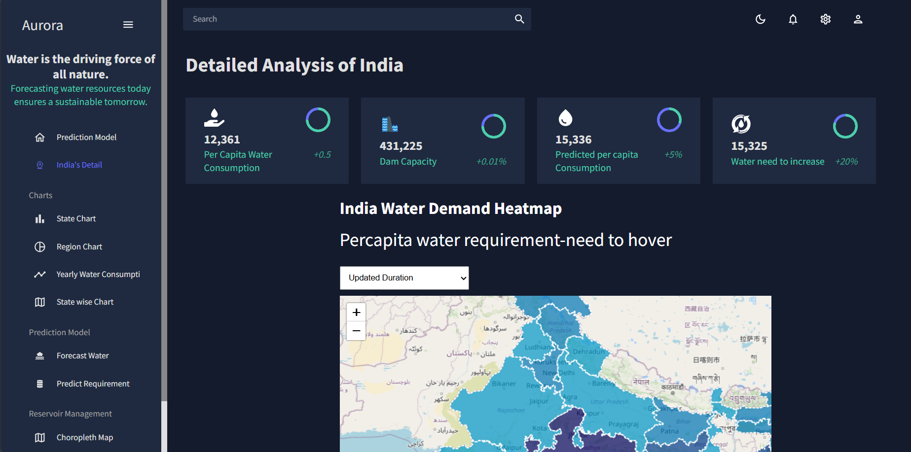
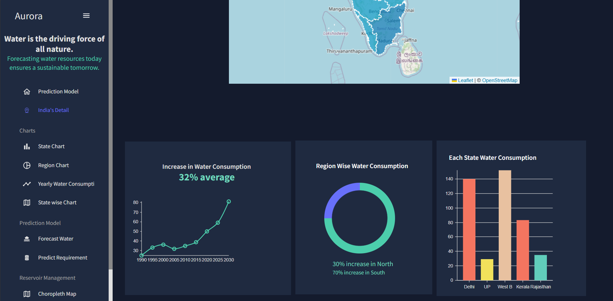
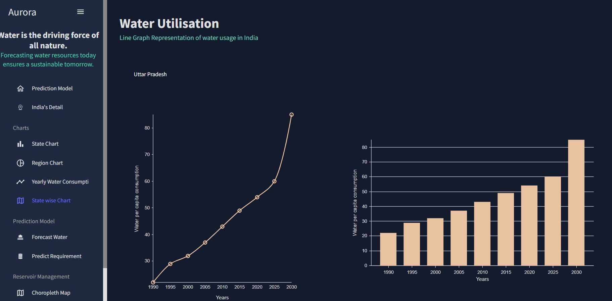
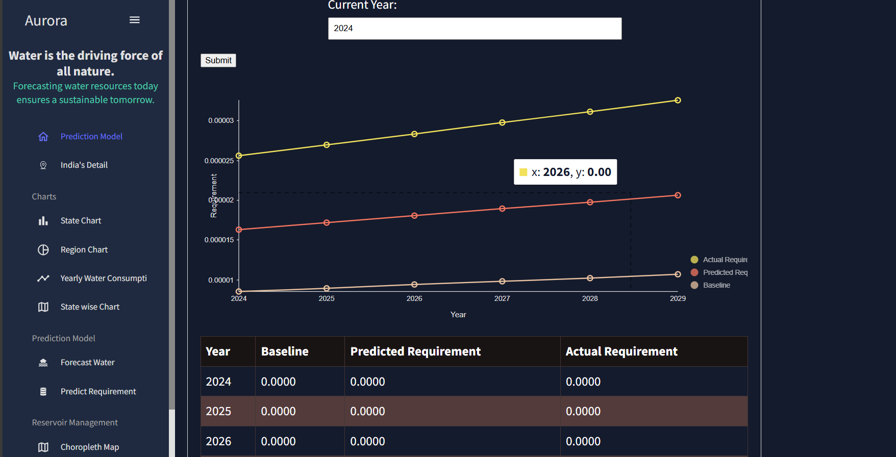

# Aurorus


# Water Resources Management Dashboard

## Background

Water resources are fundamental to sustaining human life, agriculture, industry, and ecosystems. Accurate forecasting of future water requirements, along with assessing current storage capacities, is crucial for effective water resource management and planning. With a growing population, the demands on domestic, industrial, agricultural, and ecological water use are increasing, putting strain on existing infrastructure.

## Description

The project involves analyzing the storage capabilities of reservoirs and providing a predictive model to forecast future water requirements. This model integrates various data sources, including historical water usage, climate projections, population growth trends, and agricultural practices. It accounts for variability in climate conditions, demographic shifts, and changes in land use. The goal is to create a strategic planning and decision-making support system that offers clear insights into future water demand and storage needs, identifies potential risks, and assists policymakers in planning for sustainable water management.

### Key Features

- **Predictive Modeling:** Forecasts future water requirements using historical data, climate projections, and population trends.
- **Storage Assessment:** Evaluates current and future storage capabilities of reservoirs.
- **Scenario Analysis:** Takes into account extreme weather events and demographic changes to predict potential impacts on water storage.
- **Data Visualization:** Provides interactive charts and graphs to help visualize trends, demands, and storage capacities.
- **Risk Identification:** Identifies potential gaps in storage capacity and infrastructure needs.

## Expected Solution

- **Assessment:** Evaluate existing and future storage capabilities and identify anticipated conditions and impacts.
- **Gap Identification:** Determine where additional storage and infrastructure are needed.
- **Scenario Creation:** Develop scenarios considering extreme weather events and population demands.
- **Strategic Recommendations:** Provide insights into water management issues to support sustainable water management practices.
- **Policy Support:** Aid policymakers in evolving strategies to enhance water storage capacities, optimize water usage, and mitigate risks.

## Installation

1. **Clone the Repository:**
    ```bash
    git clone(https://github.com/harshvardhan119/Aurorus.git)
    ```


## Configuration

1. **Backend Configuration:**
    - Create a `.env` file in the `server` directory and add your environment variables (e.g., database connection strings, API keys).

2. **Frontend Configuration:**
    - Update API endpoints in `client/src/config.js` with your backend server URL.

## Usage


1. **Start the Frontend Client:**
    ```bash
    cd ../client
    npm start
    ```
2. **Access the Application:**
    Open your browser and navigate to `http://localhost:3000` to view the dashboard.


## Deployed link
https://main--extraordinary-kulfi-82379a.netlify.app

Contributions are welcome! Please submit a pull request or open an issue to discuss potential improvements.
## images





